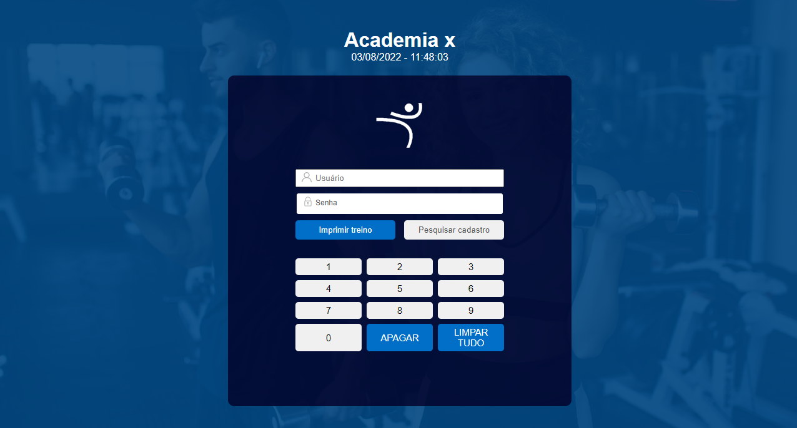
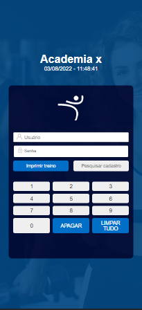

Readme

# Login Page Gym System

<!------------------------------------STACKS-->
#### Stacks:

 <a href="https://developer.mozilla.org/pt-BR/docs/Web/HTML"><a/>
   <a href="https://developer.mozilla.org/pt-BR/docs/Web/CSS"><a/>
     <a href="https://github.com/braziljs/eloquente-javascript"><a/>
   

  
  <!------------------------------------TOOLS-->
 #### Tools:
 <a href="https://code.visualstudio.com/"><a/>
  
  
  
   <!------------------------------------DESCRIPTION-->

#   Sobre o projeto <!---write here : talk a little about project: what's does, example.  -->
> Projeto criado para validar habilidades de HTML, CSS e JavaScript. Esta página de Login recebe duas entradas, username e senha. A senha é digitada pelo teclado na tela. Os botões de imprimir treino e pesquisar cadastro não possuem ações pois o objetivo deste projeto foi apenas a finalização do front-end.

  
  
  # Conhecimentos utilizados

-HTML usado para desenvolvimento da estrutura.
 
-CSS exercitado com flexbox e Grid.
 
-JavaScript para executar as ações de click nos botões, data e horário do servidor.
 
-Responsividade para desktop e mobile
